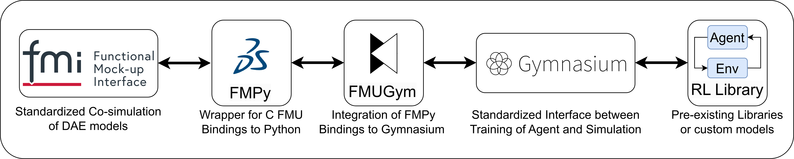
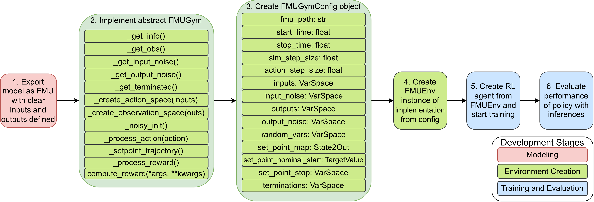
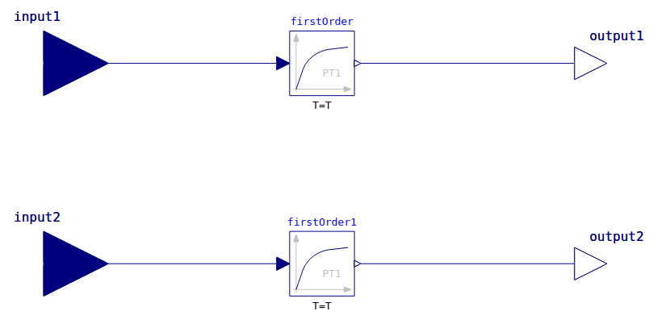
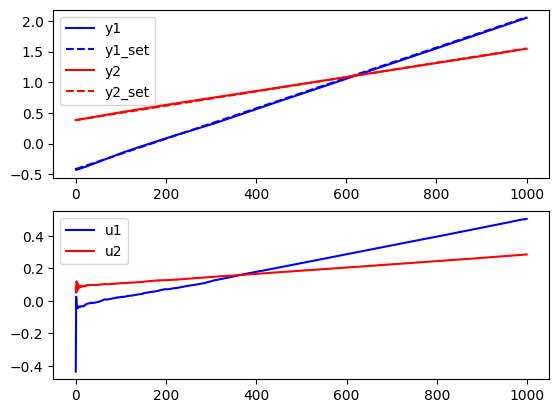

# FMUGym: An Interface for Reinforcement Learning-based Control of Functional Mock-up Units under Uncertainties
[](https://opensource.org/licenses/MIT)



This project provides an interface for reinforcement learning-based control of functional mock-up units (FMUs) under uncertainties. The interface is designed to be compatible with the [Functional Mock-up Interface (FMI)](https://fmi-standard.org/) standard. It is implemented in Python and connects FMUs as control plants to pre-existing reinforcement learning libraries such as [Stable Baselines3](https://stable-baselines3.readthedocs.io/en/master/) or [SKRL](https://skrl.readthedocs.io/en/latest/) for training.

For more information refer to the corresponding paper [FMUGym: An Interface for Reinforcement Learning-based Control of Functional Mock-up Units under Uncertainties](following soon)

## Installation
For proper installation of the project, we recommend using a python virtual environment or [poetry](https://python-poetry.org/). To create a virtual environment, run the following command:
```bash
python3 -m venv PATH_TO_VENV
```

To activate the virtual environment, run the following command:
```bash
source PATH_TO_VENV/bin/activate
```

To install the project, run the following command from the root direc tory of the fmugym project:
```bash
pip install -e .
```

Further, we recommend using jupyter notebooks for testing. To install jupyter notebook, run the following command:
```bash
pip install notebook
```

As reinforcement learning libraries, we tested Stable Baselines3 and SKRL. To install Stable Baselines3, run the following command:
```bash
pip install stable-baselines3
```

To install SKRL, run the following command:
```bash
pip install skrl
```
## Content
This project contains the following content:    
1. [fmugym](fmugym): The library containing the abstract FMUGym interface and classes for the environment configuration. 
2. [examples](examples): Jupyter notebooks demonstrating the usage of FMUGym
    - [dummy default](examples/dummy_fmugym.ipynb): A linear MIMO system connected to an SB3 SAC agent with continuous action and observation space. All possible kinds of uncertainties are included as well as comprehensive comments.
    - [dummy skrl](examples/dummy_fmugym_skrl.ipynb): A linear MIMO system connected to an SKRL SAC agent with continuous action and observation space.
    - [dummy discrete](examples/dummy_discrete_fmugym.ipynb): A linear MIMO system connected to an SB3 A2C agent with discrete action and observation space.
    - [nonlinear](examples/Nonlinear_example.ipynb): A nonlinear MIMO system connected to an SB3 SAC agent with continuous action and observation space.
3. [FMUs](examples/FMUs): A collection of Modelica models and their corresponding FMUs used in the examples. We just provide FMUs exported with Open Modelica for Linux x86. If you are running on another OS / architecture, please export the FMUs accordingly. \
Further, we chose the CVODE solver used by Open Modelica, which is causing [issues](https://github.com/OpenModelica/OpenModelica/issues/11506) in long simulation runs. So we recommend exporting Modelica models with e.g. Dymola instead on your own. 
4. [trained_agents](examples/trained_agents): Models of RL agents after completing training.
5. [tests](tests): Unit tests for compliance of FMUGym library with gymnasium API.

## Usage
The following code snippet demonstrates the usage of FMUGym for the most simple linear MIMO system connected to an SB3 agent with continuous action and observation space. For specific implementations please see the [dummy example notebook](examples/FMUs/dummy_for_FMU.mo) notebook.



### 1 FMU export
The first step involves exporting the desired Modelica model as a co-simulation FMU compliant with FMI 1.0/2.0/3.0. The inputs and outputs of the model have to be clearly defined using the appropriate Modelica standard library blocks (Modelica.Blocks.Interfaces.RealInput for inputs and Modelica.Blocks.Interfaces.RealOutput for outputs). See below the model view of our [dummy example](examples/FMUs/dummy_for_FMU.mo) in Open Modelica.



### 2 Implement abstract FMUGym class
```python
class FMUEnv(FMUGym):
    ...
```
The super class FMUGym has to be inherited for model-specific utilization by implementing the following abstract methods:
- `_get_info()`: Used by `step()` and `reset()`, returns any relevant debugging information.
- `_get_obs()`: Retrieves FMU output values by possibly calling `self.fmu._get_fmu_output` for handling different FMU versions and stores them in the `self.observation` dictionary. It can also add output noise (using `self._get_output_noise()`) and update the set point (using `self._setpoint_trajectory()`) to return a goal-oriented observation dictionary.
- `_get_input_noise()`: Returns input noise for each input component, potentially by sampling from the self.input_noise dictionary.
- `_get_output_noise()`: Similar to `self._get_input_noise`, generates output noise for each output component, potentially by sampling from the `self.output_noise dictionary`.
- `_get_terminated()`: Returns two booleans indicating first the termination and second truncation status.
- `_create_action_space(inputs)`: Constructs the action space from a `VarSpace` object representing the inputs. It can use `gymnasium.spaces.Box` for continuous action spaces.
- `_create_observation_space(outputs)`: Constructs the observation space returning it as a `gymnasium.spaces.Dict`. The observation space typically includes observation, `achieved_goal`, and `desired_goal`, each created from a `VarSpace` object.
- `_noisy_init()`: Random variations to initial system states and dynamic parameters by sampling from `self.random_vars_refs` and propagates to corresponding initial output values. It also allows for direct manipulation and randomization of set point goals using the `self.y_stop` class variable.
- `_process_action(action)`: Called by `self.step()` to add noise to action from RL library. May be used to execute low-level controller and adapt action space.
- `_setpoint_trajectory()`: Determines the set point values at the current time step within the trajectory, called by `self._get_obs()`.
- `_process_reward(self, obs, acts, info)`: Interface between step method of fmugym and compute_reward. adjusts the necessary paramters for reward method of RL library (SKRL, SB3).
- `compute_reward()`: Computes and returns a scalar reward value in case of SB3 from `achieved_goal`, `desired_goal`, and possibly further parameters.

### 3 Create FMUGymConfig object
```python
config = FMUGymConfig(...)
```
By passing an FMUGymConfig object containing the necessary parameters to the FMUGym implementation an environment instance can be created. 
Several custom data types simplify the environment configuration:
-  VarSpace: Holds a dictionary of class variables. It provides methods like
add_var_box(name: str, min: float, max: float) to add a gymnasium.spaces.Box entry or add_var_discrete(name: str, n: int, start: int) to add a gymnasium.spaces.Discrete.
- State2Out: Holds a dictionary of class variables. It offers an add_map(state: str, out: str) method to map a system state variable to an output variable.
- TargetValue: Holds a dictionary of class variables. The method add_target(name: str, value: float) incorporates a target value, such as a nominal initial output value.

### 4 Create FMUEnv object
```python
dummyEnv = FMUEnv(config)
```
Create instance of previously implemented FMUEnv by passing the config object to it.

### 5 Creation of RL agent from FMUEnv and start training
```python
model = ...
```
Create the RL agent leveraging a pre-existing library like Stable Baselines3 or SKRL or implement a custom RL method compatible to the gymnasium standard.
Proceed with training the agent and save the resulting policy.

### 6 Evaluate performance of policy with inference
Running one inference episode with the trained agent while capturing trajectories. To statistically assess the trained agent's performance, the
optimized policy can be deployed for multiple randomized episodes to evaluate the results.



## License
This project is licensed under MIT license, as found in the [LICENSE](LICENSE) file.

## Citing
The corresponding paper was submitted to the European Group for Intelligent Computing in Engineering (EG-ICE) conference 2024 in Vigo. We will provide information for citing the paper as soon as it is published.